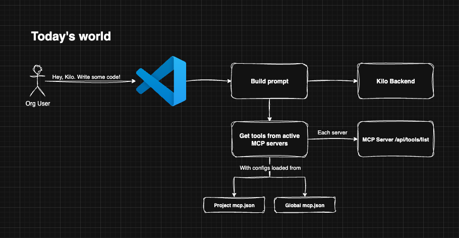
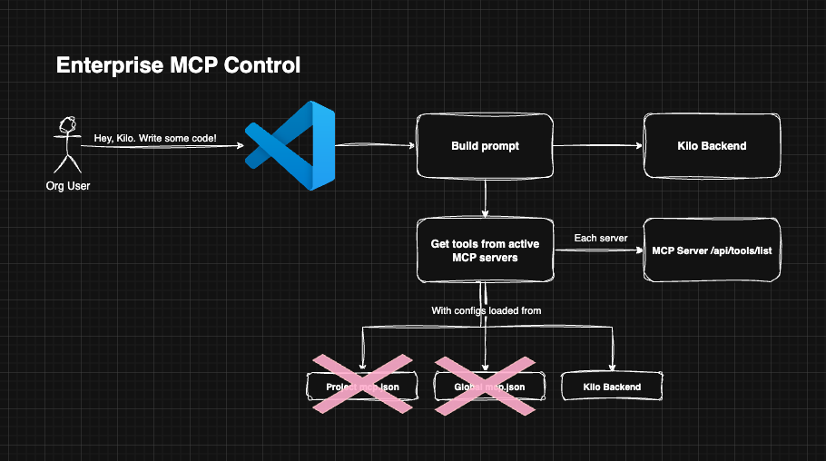
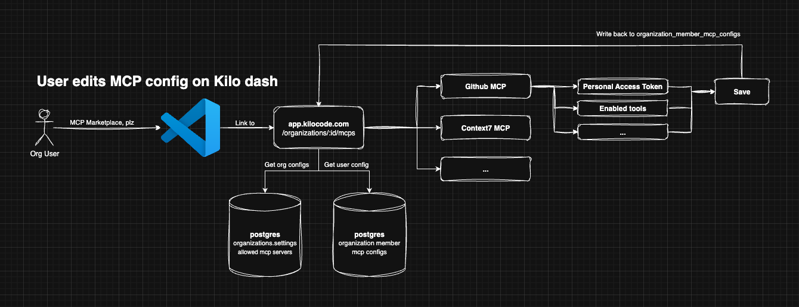

# Enterprise MCP Controls

### Overview

Enterprise customers need to maintain control over the tools their developers use to ensure security, compliance, and cost management. Developers using Kilo Code can configure and use any MCP (Model Context Protocol) server, including public marketplace offerings or arbitrary custom servers. This lack of administrative oversight introduces risk for our enterprise customers, as it allows for the potential use of unvetted, insecure, or costly tool calls.

This document specifies a new feature, **Enterprise MCP Controls**, which allows organization administrators to define an **allowlist** of approved MCP servers. Kilo Code (CLI/Extension) can enforce this allowlist, ensuring that developers within the organization can only use sanctioned MCPs.

### MVP Requirements

#### 1. Dashboard App

- **View and Manage Allowlist:** Organization administrators must have a dedicated section in the dashboard to manage their MCP allowlist.
- **Default Configuration:** By default, new and existing organizations will have **all** marketplace MCPs enabled to ensure no disruption of service.
- **Marketplace MCPs:** The dashboard must display a comprehensive list of all MCPs available in the official Kilo Code Marketplace.
- **Selection UI:** Administrators must be able to easily select and deselect MCPs to add or remove them from the organization's allowlist.
- **Audit Logs:** Any changes made to MCP allow list must show up in the Audit Logs

#### 2. Extension

- **Allowlist Enforcement:** The VS Code extension and future CLI must strictly enforce the organization's MCP allowlist.
- **Filtered Marketplace:** The in-extension "MCP Marketplace" view must **only** display MCPs that are on the organization's allowlist.
- **Ignore Disallowed MCPs:** If an MCP server configured in `mcp.json` is **not** on the allowlist, the extension must ignore it. It should not be activated, displayed as an option, or used for any operations.
- **User Feedback:** The extension should provide clear, non-blocking visual feedback to the developer indicating which locally configured MCPs are disallowed by their organization's policy (e.g., graying out the entry, showing a warning icon).

## System Design

When the Enterprise MCP Controls feature is enabled, extension users can no longer use locally configured MCP definitions. Instead of pulling MCP configurations from the end-user's filesystem, the configuration will be pulled from the Kilo Code API, scoped to the organization.

#### How Kilo/MCP works today



#### How Kilo/MCP works with enterprise controls



### Schema

We will piggy-back off of the existing organization.settings jsonb field for administrator to configure MCP Controls:

```ts
const OrganizationSettings_MCPControls = z.object({
	mcp_controls_enabled: z.boolean().optional(),
	mcp_controls_allowed_marketplace_servers: z.string().optional(),
})
```

For end-users, since the mcp.json payload is no longer configurable locally, they will need to configure it via the Kilo Code dashboard. Since these configurations often contain API keys, we will encrypt the entire payload prior to insertion:

```sql
create table if not exists organization_member_mcp_configs (
  id uuid not null default uuid_generate_v4(),
  organization_id uuid not null references organizations(id),
  kilo_user_id text not null references kilocode_users(id),
  config bytea not null,
  created_at timestamptz not null default now()
)
```

The config payload definition should look something like:

```ts
const OrganizationMemberMCPConfig = z
	.object({ mcp_id: z.string(), parameters: z.record(z.string(), z.string()) })
	.array()
```

### Dashboard App

#### Owner experience

There will be a new page in the left-hand navigation for Enterprise users only called "MCP Control" `/organizations/:id/mcp-control`. For owners, this page will allow control of which MCP marketplace items are allowed. It will `GET /api/marketplace/mcps` to retrieve the canonical list of MCP servers in our marketplace. It will also call the relevant getOrganization trpc function to get the org settings. By default, this feature is turned off. Also by default, all MCP servers will be selected.

#### Organization user experience



When org users want to configure and use an MCP server and if organizations.settings.mcp_controls_enabled is true, they will be directed to the Kilo Code dashboard application `/organizations/:id/mcp-control`. Users will be able to enable, disable, and configure approved MCP servers.

There will be a configuration UI similar to what's in the extension today. All configurations are encrypted and saved in our database.

### Extension

When organizations.settings.mcp_controls_enabled is true, the MCP marketplace view should be replaced with a link to configure MCP on the Kilo Code dashboard. When it is false-y, the experience is the same as it is today.

## Scope and implementation plan

Rough plan. These action items will become tickets after spec is approved:

- Backend
    - Schema changes for new organization_member_mcp_configs table
    - Implement org settings endpoint changes to allow for mcp-control features (enabled, allow list)
    - Implement TRPC routes for org members to update approved mcp installation settings
    - Implement mcp-control UI for administrators
    - Implement mcp server installation UI for end users
- Extension
    - When organizations.settings.mcp_controls_enabled is true, the MCP marketplace view should be replaced with a link to configure MCP on the Kilo Code dashboard

## Features for the future

- Org-provided custom MCP server configurations (i.e. non-marketplace MCPs)
- Project-level MCP configurations
- Tool call audits - who is running what tool and why?
    - Split out by user, project, MCP server (if applicable)
    - Why? If you're really concerned about locking down MCP servers then the only way to know if our product is truly doing what it's saying it is is to provide admins with tool call audit logs
