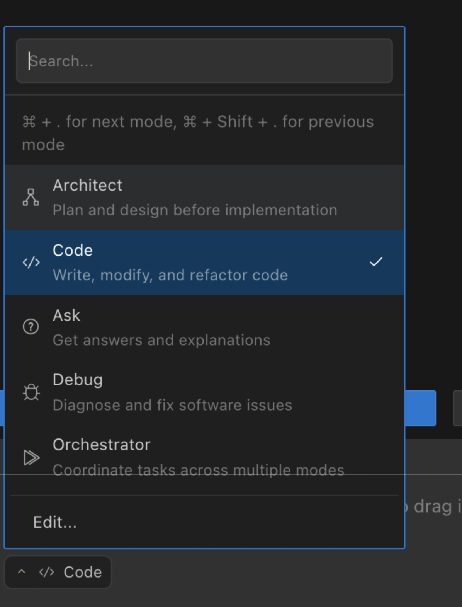
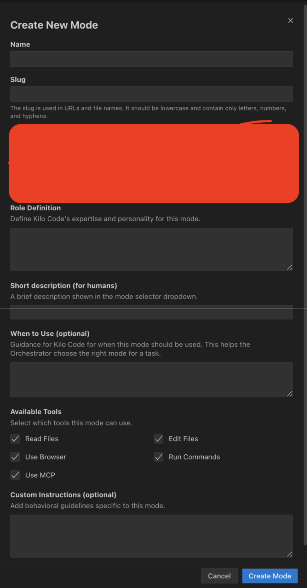

# Organization Modes Library

# Overview

We want to expand the value of teams & enterprise and make it more useful for collaboration and hopefully increase 'lock in' to the Kilo platform. We can build something _like_ a prompt library, but a bit more powerful. We can leverage Kilo's unique "modes" which already has "marketplace" support to enable teams & enterprises to define and manage modes on the backend webapp and have those modes show up in the modes marketplace if the user is using an organization in the extension. This feature is mostly valuable in larger organizations where they work on many different repositories. If you have very few repositories, then the value is low since you can also store custom modes within the git repo, effectively sharing it with anyone who uses the repo already.

# Requirements

This section outlines the detailed requirements that the solution will fulfill.

- Ability for an organization to have custom modes visible in the web UI.
- Fetch the organization custom modes and show them by default if you switch to an organization alongside any other modes you have manually installed & the "base" modes like "code" "architect" etc. Important consideration here is the organization also has a "code" mode it should overwrite the built in one. This allows the organization owners to modify the built in prompts.
- Ability for team members (or owners only?) to do crud on modes on the UI of the web, including uploading/downloading yaml directly, editing the yaml, and having a form style editor as seen in the extension.
- Web ui showing a list of modes and common info like when created, who created, and when updated.
- Auditing of Custom Mode CRUD operations in the Kilo backend web UI.

### Non-requirements

- Disabling the mode marketplace or removing built-in modes.
- Disabling custom modes created locally by an organization member.
- Ability to upload modes from the extension into the web backend via a special extension button.
- Extending the mode definition to include a suggested model to use with the mode (that would be nice though)

# System Design





Currently extension fetches available modes from the "mode marketplace" by downloading a "modes.yaml" file from our backend. We will add an endpoint the extension can call with a user & org id and it can return any organization modes. Those will be merged into the mode list and dropdown shown to the user.

The organization modes themselves will be saved in postgres, and there will be both a form style editing UI based on what's in the extension.

Will add a new section to the backend UI to view custom org modes, edit them, create new ones, etc.

Schema change:

```sql
CREATE TABLE organization_modes (
  id uuid primary key,
  organization_id uuid not null,
  name text not null,
  slug text not null,
  created_by text not null,
  created_at timestamptz default now(),
  updated_at timestamptz default now(),
  config jsonb
)
```

We're recommending using jsonb for the non _critical_ pieces of the modes so it's easier to keep in sync with the extension vs a schema we have to migrate (not everyone updates to the most recent extension immediately, for example)

# Scope and implementation

- Schema migration
- Make CRUD ui on backend, feature flagged out to only our organization to begin with. Estimate this is 1 day of work.
- Make endpoint to return org modes
- Render org modes in extension. Estimating 2 days for this because we are both unfamiliar with how to work on extension, and there be dragons there.

# Compliance Considerations

Should log any mode CRUD operations to audit logs for enterprise. Otherwise, none.

## Open questions

- Teams or enterprise? My vote is teams
