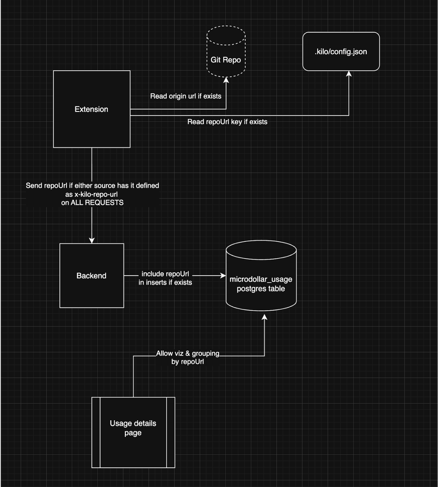

# Track Usage by Project

# Overview

We will define a "project" as a **repository** and will be identified by `project.id`. We can automatically get the `project.id` from the git remote `origin` if it doesn't exist, but also introduce the concept of a `.kilocode/config.json` file which you can use to manually set (and override in the case of an `origin` remote existing) `project.id`. This allows for "automagic" configuration in most cases, but for an override and helps with things like monorepos which can contain multiple "projects." It also stands in for places where the code structure is less defined like using kilo-cli or running Kilo cloud agents on checked out pieces of code, etc.

This will allow us to track which projects are used for every LLM call in the `microdollar_usage` table. We can then add this very easily to reporting to show how much of your costs are going to each "project" (identified by unique `project.id`). This feature is a prerequisite for "project based settings."

## System Design



### Example config

```jsonc
{
	// Example configuration for project settings
	"project": {
		// Kilo Code project ID
		"id": "my-project",
	},
}
```

## Implementation Plan

- Modify extension to get the `project.id` by getting the `origin` url from the git remotes.
- Modify extension to support an optional `.kilocode/config.json` and add the addition of `project.id` to the config file there.
- Modify extension to send `project.id` in a header to our backend OpenRouter endpoint (maybe `X_KILOCODE_PROJECTID`)
- Add some kind of json-schema to this file for some auto-complete goodness.
- Modify **all** backend requests to include the `project.id` if it exists as an http header.
- Modify `microdollar_usage` and add the `project_id` column.
- Modify usage details to support grouping by `repo_url` and seeing "who worked on **what**, when, and how much did it cost."

# Compliance Considerations

I don't think it will hurt to save this, particularly since they can remove it by setting `project.id: ""` in `.kilocode/config.json`.
