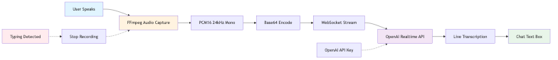

# Live Voice Transcription

# Overview

Developers can code 3-5x faster by dictating rather than typing, yet Kilo Code currently has no voice input capability. This creates friction for users who want to quickly describe complex features or iterate on ideas hands-free.

This spec proposes adding live voice transcription to the chat interface, replacing the send button with a microphone icon when the text box is empty. Users can speak naturally while seeing real-time transcription appear in the input field, dramatically improving coding velocity for voice-preferred workflows.

The MVP will use OpenAI's Realtime API with FFmpeg-based audio streaming for low-latency transcription (~100ms). This mirrors the approach used by Cursor and Cline, proven to work well in VS Code environments.

# Requirements

- **Microphone Icon UI**: Add microphone icon button that allows starting/stopping the transcription
- **Live Transcription Display**: Show real-time transcription in the chat text box as user speaks
- **FFmpeg Audio Streaming**: Use FFmpeg to capture and stream audio to transcription API
- **Realtime API Integration**: Use OpenAI's Realtime API for near-instant transcription
- **Visual Recording Indicator**: Show clear UI state when recording is active (animated volume bars or similar)
- **Typing Stops Recording**: Any keyboard input immediately stops transcription and returns to normal mode
- **Cross-Platform FFmpeg Docs**: Provide installation instructions for Windows, macOS, and Linux
- **OpenAI Provider Required**: Feature only available when user has configured an OpenAI API key in their provider settings. (This uses the user's own OpenAI credits, not Kilo Code credits.)

### Non-requirements

- Custom glossary / file / workflow support (future enhancement)
- Real-time volume visualization (future enhancement)
- Alternative transcription providers beyond OpenAI (future)
- Kilo Code provider integration for voice transcription (future)
- **Usage cost tracking/display** (not in initial version, but should be added in a future version since costs are separate from Kilo Code credits)
- Server-side/backend transcription (future)
- FFmpeg automatic installation or bundling
- Voice commands or shortcuts beyond start/stop

# System Design

## Architecture Overview

The system follows a straightforward streaming architecture where user voice input is captured by FFmpeg, streamed as PCM16 audio to OpenAI's Realtime API via WebSocket, and transcribed text is displayed live in the chat input box. Typing interrupts recording instantly.

## Core Components

### 1. Audio Capture Service

- Spawn FFmpeg as child process from extension host
- Platform-specific audio input configuration:
    - **macOS**: `avfoundation`
    - **Windows**: `dshow` (DirectShow)
    - **Linux**: `alsa` or `pulse`
- Stream PCM16 format at 24kHz mono (required by OpenAI)
- Handle permissions errors and FFmpeg availability checks

### 2. WebSocket Connection

- Direct WebSocket connection from extension to OpenAI Realtime API
- Secure API key storage in extension settings (existing provider system)
- Base64 encode audio chunks for transmission
- Handle connection lifecycle (connect, stream, disconnect)

### 3. UI State Management

- **Empty Input State**: Show microphone icon
- **Recording State**: Animate microphone, show "Recording..." indicator
- **Transcribing State**: Show live transcription with typing cursor
- **Manual Stop**: Typing any key stops recording and clears recording indicator
- **Error State**: Show clear error message if FFmpeg not found or permissions denied

### 4. Cost Considerations

- OpenAI Realtime API: **$0.60 per minute**
- **Cost is charged to user's OpenAI account**, not Kilo Code credits
- Display cost warning in settings or first-time use
- Consider adding usage tracking/warnings for high-volume users

## FFmpeg Detection & Setup

**Installation Check Flow**:

1. On extension activation, verify FFmpeg is available via `ffmpeg -version`
2. If not found, show dismissible banner with installation instructions
3. Link to documentation with platform-specific guides
4. Gracefully disable voice feature if FFmpeg unavailable

**Documentation Structure**:

- `docs/user-guide/voice-transcription-setup.md`
    - Prerequisites section
    - Platform-specific installation
    - Troubleshooting common issues
    - Permissions setup (especially macOS)

## Scope/Implementation

### Phase 1: Core Infrastructure

- Add FFmpeg detection on extension startup
- Create `AudioCaptureService` class with platform-specific FFmpeg spawning
- Implement WebSocket connection to OpenAI Realtime API
- Add basic error handling and cleanup

### Phase 2: UI Integration

- Add microphone icon component to chat input
- Implement state management for recording/transcribing modes
- Wire up transcription events to populate chat input box
- Add typing detection to stop recording
- Add visual recording indicator

### Phase 3: Polish & Docs

- Write cross-platform FFmpeg installation guide
- Add cost warning in settings UI
- Test on Windows, macOS, Linux
- Handle edge cases (permissions, no FFmpeg, API errors)
- Add analytics tracking for feature usage

# Features for the future

- **Custom Glossary**: Use OpenAI Whisper API's glossary parameter for code-specific terminology
- **Real-time Volume Indicator**: Show live audio input levels during recording
- **Chunked Whisper API Mode**: Add cheaper option ($0.06/min) for users who can tolerate 2-5s latency
- **Provider Flexibility**: Support alternative transcription providers (Deepgram, AssemblyAI)
- **Server-side Transcription**: Move transcription to backend for better security/control
- **Voice Commands**: Implement "stop recording," "send message," and other voice shortcuts
- **Automatic FFmpeg Installation**: Bundle or auto-install FFmpeg to reduce setup friction
- **Recording History**: Save voice recordings locally for debugging or replay
- **Multi-language Support**: Extend beyond English with language detection
- **Usage Cost Tracking**: Display voice transcription costs somewhere (since this would be separate from Kilo Code credits)
