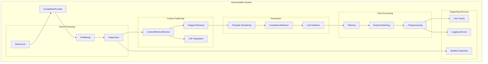
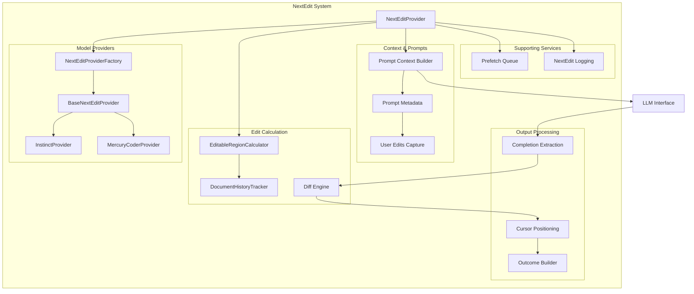

# Architecture Documentation

Technical architecture documentation for the ContinueDev library within the Kilocode monorepo.

> **Note**: This library is a streamlined extraction from the [Continue](https://github.com/continuedev/continue) project, containing only autocomplete and NextEdit functionality. All GUI, chat, agents, and other features have been removed. It's integrated into Kilocode as a TypeScript service library at `src/services/continuedev/`.

## Table of Contents

- [System Overview](#system-overview)
- [Component Architecture](#component-architecture)
- [Data Flow](#data-flow)
- [Core Concepts](#core-concepts)
- [Directory Structure](#directory-structure)
- [Extension Points](#extension-points)
- [Design Decisions](#design-decisions)

---

## System Overview

The library is architected as a layered system with clear separation of concerns:

```
┌─────────────────────────────────────────────────────────────┐
│                    IDE Integration Layer                     │
│              (VSCode, JetBrains, Custom IDEs)                │
└────────────────────────┬────────────────────────────────────┘
                         │ IDE Interface
                         │
┌────────────────────────▼────────────────────────────────────┐
│                   Provider Layer                             │
│  ┌──────────────────────┐    ┌──────────────────────────┐  │
│  │  CompletionProvider  │    │   NextEditProvider       │  │
│  │  (Autocomplete)      │    │   (Edit Prediction)      │  │
│  └──────────┬───────────┘    └───────────┬──────────────┘  │
└─────────────┼────────────────────────────┼─────────────────┘
              │                            │
┌─────────────▼────────────────────────────▼─────────────────┐
│                    Core Services Layer                       │
│  ┌────────────────┐  ┌─────────────┐  ┌─────────────────┐ │
│  │ Context        │  │ LLM         │  │ Configuration   │ │
│  │ Retrieval      │  │ Integration │  │ Management      │ │
│  └────────────────┘  └─────────────┘  └─────────────────┘ │
└──────────────────────────────────────────────────────────────┘
              │                            │
┌─────────────▼────────────────────────────▼─────────────────┐
│                  Utility & Infrastructure                    │
│  ┌────────────┐  ┌──────────┐  ┌───────────┐  ┌─────────┐ │
│  │Tree-sitter │  │  Diff    │  │  Caching  │  │ Logging │ │
│  │  (AST)     │  │  Engine  │  │  (LRU)    │  │ Service │ │
│  └────────────┘  └──────────┘  └───────────┘  └─────────┘ │
└──────────────────────────────────────────────────────────────┘
```

### Layer Responsibilities

1. **IDE Integration Layer**: Adapts the library to specific IDEs through the `IDE` interface
2. **Provider Layer**: Main entry points for autocomplete and NextEdit features
3. **Core Services Layer**: Shared business logic for context, LLM communication, and configuration
4. **Utility & Infrastructure**: Low-level utilities and infrastructure components

---

## Component Architecture

### Autocomplete Architecture



#### Key Components

1. **CompletionProvider** ([`core/autocomplete/CompletionProvider.ts`](core/autocomplete/CompletionProvider.ts))

    - Main orchestrator for autocomplete
    - Coordinates all sub-systems
    - Manages completion lifecycle

2. **ContextRetrievalService** ([`core/autocomplete/context/ContextRetrievalService.ts`](core/autocomplete/context/ContextRetrievalService.ts))

    - Gathers relevant code context
    - Collects recently edited files
    - Retrieves LSP definitions

3. **CompletionStreamer** ([`core/autocomplete/generation/CompletionStreamer.ts`](core/autocomplete/generation/CompletionStreamer.ts))

    - Streams completions from LLM
    - Applies real-time filters
    - Handles abort signals

4. **BracketMatchingService** ([`core/autocomplete/filtering/BracketMatchingService.ts`](core/autocomplete/filtering/BracketMatchingService.ts))
    - Validates bracket balance
    - Tracks bracket context
    - Filters invalid completions

### NextEdit Architecture



#### Key Components

1. **NextEditProvider** ([`core/nextEdit/NextEditProvider.ts`](core/nextEdit/NextEditProvider.ts))

    - Main orchestrator for NextEdit
    - Coordinates edit prediction workflow
    - Manages provider selection

2. **BaseNextEditProvider** ([`core/nextEdit/providers/BaseNextEditProvider.ts`](core/nextEdit/providers/BaseNextEditProvider.ts))

    - Abstract base for model-specific providers
    - Defines provider interface
    - Implements common functionality

3. **NextEditEditableRegionCalculator** ([`core/nextEdit/NextEditEditableRegionCalculator.ts`](core/nextEdit/NextEditEditableRegionCalculator.ts))

    - Calculates editable regions
    - Determines edit scope
    - Supports full-file and partial-file modes

4. **DocumentHistoryTracker** ([`core/nextEdit/DocumentHistoryTracker.ts`](core/nextEdit/DocumentHistoryTracker.ts))
    - Tracks document changes over time
    - Captures user edit patterns
    - Provides edit history for context

---

## Data Flow

### Autocomplete Data Flow

```
User Types
    │
    ▼
┌─────────────────────┐
│  IDE Integration    │
│  • Captures input   │
│  • Gets cursor pos  │
└──────────┬──────────┘
           │
           ▼
┌─────────────────────┐
│  Debouncer          │
│  • Delays request   │
│  • Prevents spam    │
└──────────┬──────────┘
           │
           ▼
┌─────────────────────┐
│  Prefiltering       │
│  • Early checks     │
│  • Security check   │
└──────────┬──────────┘
           │
           ▼
┌─────────────────────┐
│  Context Gathering  │
│  • File contents    │
│  • Recent edits     │
│  • LSP definitions  │
│  • Snippets         │
└──────────┬──────────┘
           │
           ▼
┌─────────────────────┐
│  Prompt Building    │
│  • Tokenization     │
│  • Template render  │
│  • Token limiting   │
└──────────┬──────────┘
           │
           ▼
┌─────────────────────┐
│  LLM Generation     │
│  • Stream request   │
│  • Token by token   │
└──────────┬──────────┘
           │
           ▼
┌─────────────────────┐
│  Real-time Filter   │
│  • Stop sequences   │
│  • Invalid syntax   │
└──────────┬──────────┘
           │
           ▼
┌─────────────────────┐
│  Post-processing    │
│  • Format clean-up  │
│  • Bracket match    │
│  • Cache storage    │
└──────────┬──────────┘
           │
           ▼
┌─────────────────────┐
│  Display to User    │
│  • Ghost text       │
│  • Inline display   │
└─────────────────────┘
```

### NextEdit Data Flow

```
User Makes Edit
    │
    ▼
┌─────────────────────┐
│  History Tracking   │
│  • Capture change   │
│  • Store in history │
└──────────┬──────────┘
           │
           ▼
┌─────────────────────┐
│  Trigger Condition  │
│  • Selection change │
│  • Edit completion  │
└──────────┬──────────┘
           │
           ▼
┌─────────────────────┐
│  Region Calculation │
│  • Editable range   │
│  • Window size      │
└──────────┬──────────┘
           │
           ▼
┌─────────────────────┐
│  Context Building   │
│  • File contents    │
│  • Recent edits     │
│  • User excerpts    │
└──────────┬──────────┘
           │
           ▼
┌─────────────────────┐
│  Prompt Generation  │
│  • Model-specific   │
│  • Format context   │
└──────────┬──────────┘
           │
           ▼
┌─────────────────────┐
│  LLM Prediction     │
│  • Generate edits   │
│  • Full response    │
└──────────┬──────────┘
           │
           ▼
┌─────────────────────┐
│  Response Parsing   │
│  • Extract code     │
│  • Parse structure  │
└──────────┬──────────┘
           │
           ▼
┌─────────────────────┐
│  Diff Calculation   │
│  • Myers algorithm  │
│  • Line-by-line     │
└──────────┬──────────┘
           │
           ▼
┌─────────────────────┐
│  Cursor Positioning │
│  • Calculate new pos│
│  • Apply offsets    │
└──────────┬──────────┘
           │
           ▼
┌─────────────────────┐
│  Display Edits      │
│  • Visual feedback  │
│  • Jump navigation  │
└─────────────────────┘
```

---

## Core Concepts

### 1. Context Gathering

Autocomplete and NextEdit both rely on gathering relevant context:

**Context Types**:

- **File Context**: Current file contents, prefix/suffix around cursor
- **Workspace Context**: Recently edited files, open files
- **Semantic Context**: LSP definitions, imports, related code
- **User Context**: Clipboard, recent selections, edit patterns

**Context Retrieval Strategy**:

```typescript
// Prioritized context gathering
1. Current file context (prefix + suffix)
2. Recently edited ranges in current file
3. Recently edited files in workspace
4. LSP definitions at cursor
5. Similar code snippets from workspace
6. Imports and dependencies
```

### 2. Tree-sitter Integration

Tree-sitter provides accurate syntax-aware code analysis:

**Usage**:

- **AST Parsing**: Parse code into syntax trees
- **Code Navigation**: Find definitions, references
- **Context Extraction**: Extract relevant code blocks
- **Syntax Validation**: Validate completions

**Query Files** ([`core/tag-qry/`](core/tag-qry/)):

- Language-specific queries for extracting code structures
- Tag queries for finding definitions, classes, functions
- Used for building code context

### 3. LLM Communication

The library abstracts LLM communication through the `ILLM` interface:

**Supported Operations**:

- **Fill-in-the-Middle (FIM)**: For autocomplete (prefix + suffix → middle)
- **Chat Completion**: For NextEdit (context → predicted edits)
- **Streaming**: Token-by-token generation for real-time filtering

**Provider Implementation**:

```typescript
// LLM providers implement ILLM interface
class OpenAI implements ILLM {
	async *streamFim(prefix: string, suffix: string, signal: AbortSignal) {
		// Call OpenAI API with FIM format
		// Stream tokens back
		for await (const token of stream) {
			yield token
		}
	}
}
```

### 4. Caching Strategy

**LRU Cache** ([`core/autocomplete/util/AutocompleteLruCache.ts`](core/autocomplete/util/AutocompleteLruCache.ts)):

- Caches completions by prefix
- Reduces redundant LLM calls
- Configurable cache size
- Thread-safe implementation

**Cache Key**: Normalized prefix (whitespace-stripped, lowercased)

**Cache Hit Flow**:

```
Request → Check Cache → Hit? → Return Cached
                      ↓ Miss
                    Generate → Store → Return
```

### 5. Diff Algorithm

**Myers Diff** ([`core/diff/myers.ts`](core/diff/myers.ts)):

- Efficient line-by-line diff calculation
- Identifies additions, deletions, unchanged lines
- Used for NextEdit to show predicted changes

**Stream Diff** ([`core/diff/streamDiff.ts`](core/diff/streamDiff.ts)):

- Processes diffs incrementally
- Enables real-time diff display
- Supports partial results

### 6. Filtering & Validation

**Prefiltering** ([`core/autocomplete/prefiltering/`](core/autocomplete/prefiltering/)):

- Checks before LLM call (security, file type)
- Prevents wasted LLM calls

**Real-time Filtering**:

- Stop sequences (end of function, invalid syntax)
- Streaming filters applied token-by-token

**Post-filtering**:

- Bracket matching validation
- Indentation correction
- Remove duplicates

### 7. Multiline Detection

**Algorithm** ([`core/autocomplete/classification/shouldCompleteMultiline.ts`](core/autocomplete/classification/shouldCompleteMultiline.ts)):

- Analyzes cursor context
- Determines if multiline completion is appropriate
- Considers: cursor position, syntax context, previous completions

**Heuristics**:

- Inside empty function: multiline
- After opening brace: multiline
- Middle of line: single line
- Configurable override

---

## Directory Structure

### Detailed Directory Map

```
core/
├── autocomplete/              # Autocomplete feature
│   ├── CompletionProvider.ts  # Main orchestrator
│   ├── MinimalConfig.ts       # Configuration provider
│   ├── types.ts               # Type definitions
│   │
│   ├── classification/        # Completion classification
│   │   └── shouldCompleteMultiline.ts
│   │
│   ├── context/              # Context gathering
│   │   ├── ContextRetrievalService.ts
│   │   └── ... (context providers)
│   │
│   ├── filtering/            # Completion filtering
│   │   ├── BracketMatchingService.ts
│   │   └── ... (filters)
│   │
│   ├── generation/           # LLM completion generation
│   │   ├── CompletionStreamer.ts
│   │   └── ... (generation utils)
│   │
│   ├── postprocessing/       # Post-processing
│   │   └── index.ts
│   │
│   ├── prefiltering/         # Pre-filtering
│   │   └── index.ts
│   │
│   ├── snippets/             # Code snippet retrieval
│   │   ├── index.ts
│   │   └── types.ts
│   │
│   ├── templating/           # Prompt templates
│   │   └── index.ts
│   │
│   └── util/                 # Autocomplete utilities
│       ├── AutocompleteDebouncer.ts
│       ├── AutocompleteLruCache.ts
│       ├── AutocompleteLoggingService.ts
│       ├── HelperVars.ts
│       └── types.ts
│
├── nextEdit/                 # NextEdit feature
│   ├── NextEditProvider.ts   # Main provider
│   ├── NextEditProviderFactory.ts
│   ├── NextEditEditableRegionCalculator.ts
│   ├── DocumentHistoryTracker.ts
│   ├── NextEditPrefetchQueue.ts
│   ├── NextEditLoggingService.ts
│   ├── types.ts
│   ├── utils.ts
│   │
│   ├── providers/            # Model-specific providers
│   │   ├── BaseNextEditProvider.ts
│   │   ├── InstinctNextEditProvider.ts
│   │   └── MercuryCoderNextEditProvider.ts
│   │
│   └── diff/                 # Diff utilities for NextEdit
│       └── diff.ts
│
├── llm/                      # LLM integration
│   ├── index.ts
│   ├── messages.ts           # Message formatting
│   ├── countTokens.ts        # Token counting
│   │
│   └── llms/                 # LLM implementations
│       ├── OpenAI.ts
│       └── ... (other providers)
│
├── diff/                     # Diff algorithms
│   ├── myers.ts              # Myers diff algorithm
│   ├── streamDiff.ts         # Streaming diff
│   └── util.ts               # Diff utilities
│
├── util/                     # Shared utilities
│   ├── treeSitter.ts         # Tree-sitter integration
│   ├── text.ts               # Text manipulation
│   ├── history.ts            # History management
│   ├── withExponentialBackoff.ts
│   └── ... (other utilities)
│
├── indexing/                 # Code indexing
│   ├── ignore.ts             # .continueignore handling
│   ├── continueignore.ts     # Ignore pattern parsing
│   └── ... (indexing utils)
│
├── fetch/                    # HTTP utilities
│   ├── fetch.ts              # Fetch wrapper
│   ├── stream.ts             # Stream handling
│   └── ... (fetch utilities)
│
├── tag-qry/                  # Tree-sitter queries
│   ├── tree-sitter-typescript-tags.scm
│   ├── tree-sitter-python-tags.scm
│   └── ... (language queries)
│
└── vscode-test-harness/      # VSCode integration example
    ├── src/
    │   ├── VsCodeIde.ts      # IDE implementation
    │   ├── autocomplete/     # Autocomplete integration
    │   │   ├── completionProvider.ts
    │   │   ├── GhostTextAcceptanceTracker.ts
    │   │   └── ...
    │   └── activation/       # NextEdit UI managers
    │       ├── NextEditWindowManager.ts
    │       ├── JumpManager.ts
    │       └── SelectionChangeManager.ts
    └── test/                 # Integration tests
        ├── ContinueCompletionProvider.vitest.ts
        ├── GhostTextAcceptanceTracker.vitest.ts
        └── ... (test files)
```

---

## Extension Points

The library is designed to be extensible at multiple levels:

### 1. Custom IDE Integration

Implement the `IDE` interface to integrate with any editor:

```typescript
class MyCustomIDE implements IDE {
	async readFile(filepath: string): Promise<string> {
		// Your implementation
	}

	async getWorkspaceDirs(): Promise<string[]> {
		// Your implementation
	}

	// ... implement all required methods
}
```

**Key Methods to Customize**:

- File I/O operations
- Editor state queries
- Code navigation
- UI interactions

### 2. Custom LLM Providers

Implement the `ILLM` interface for custom LLM backends:

```typescript
class MyCustomLLM implements ILLM {
	async *streamFim(prefix: string, suffix: string, signal: AbortSignal) {
		// Stream from your LLM
		for await (const token of yourLLMStream(prefix, suffix)) {
			yield token
		}
	}

	// ... implement other methods
}
```

**Supported LLM Operations**:

- Fill-in-the-middle (FIM) for autocomplete
- Chat completions for NextEdit
- Token counting
- Model listing

### 3. Custom Context Providers

Extend context gathering with custom providers:

```typescript
class CustomContextProvider {
	async getContext(filepath: string, position: Position): Promise<string> {
		// Fetch custom context (e.g., from a database, API)
		return customContext
	}
}
```

**Integration Point**: Modify `ContextRetrievalService` to include custom providers

### 4. Custom Filtering

Add custom filters to the completion pipeline:

```typescript
function customFilter(completion: string, context: HelperVars): boolean {
	// Return false to reject completion
	return isValid(completion)
}
```

**Integration Point**: Add to `CompletionStreamer` filter chain

### 5. Custom NextEdit Providers

Create model-specific NextEdit providers:

```typescript
class CustomNextEditProvider extends BaseNextEditProvider {
	async generatePrompts(context: ModelSpecificContext): Promise<Prompt[]> {
		// Build custom prompts for your model
	}

	extractCompletion(message: string): string {
		// Extract completion from model response
	}

	// ... implement other required methods
}
```

**Registration**:

```typescript
// Add to NextEditProviderFactory
NextEditProviderFactory.registerProvider("my-model", CustomNextEditProvider)
```

---

## Design Decisions

### 1. Why MinimalConfigProvider?

**Problem**: Original Continue used a complex config system with YAML parsing, control-plane integration, and profile management.

**Solution**: Created `MinimalConfigProvider` with hardcoded defaults.

**Benefits**:

- No external dependencies on config infrastructure
- Simple, understandable configuration
- Easy to extend with runtime options
- Maintains API compatibility with original system

### 2. Why Separate Autocomplete and NextEdit?

**Reasoning**:

- Different trigger conditions (typing vs. selection)
- Different LLM requirements (FIM vs. chat)
- Different UI patterns (ghost text vs. diff display)
- Independent feature evolution

**Implementation**: Separate providers that can be used together or independently

### 3. Why Stream Completions?

**Benefits**:

- Real-time filtering (stop invalid completions early)
- Better UX (show partial results)
- Reduced latency perception
- Efficient resource usage (can abort early)

**Trade-off**: More complex implementation vs. simpler batch processing

### 4. Why Tree-sitter over Regex?

**Benefits**:

- Accurate syntax understanding
- Language-agnostic queries
- Reliable code structure extraction
- Better context quality

**Trade-off**: Additional dependency, but worth it for accuracy

### 5. Why LRU Cache?

**Reasoning**:

- Completions often repeat (typing patterns)
- Limited memory footprint with LRU eviction
- Thread-safe for concurrent requests
- Significant latency improvement

**Configuration**: Cache size configurable via `TabAutocompleteOptions`

### 6. Why Abstract IDE Interface?

**Benefits**:

- IDE-agnostic core library
- Easy testing with mock IDEs
- Clear integration contract
- Multiple IDE support

**Trade-off**: Some IDE-specific optimizations harder to implement

### 7. Why Model-Specific NextEdit Providers?

**Reasoning**:

- Different models require different prompt formats
- Model-specific post-processing needs
- Allows fine-tuning per model
- Extensible for future models

**Pattern**: Factory pattern with model detection

---

## Testing Strategy

### Test Organization

```
core/
├── **/*.test.ts          # Jest unit tests (legacy)
├── **/*.vitest.ts        # Vitest unit tests (current)
└── vscode-test-harness/
    └── test/
        └── *.vitest.ts   # Integration tests
```

### Test Coverage

- **Autocomplete**: ~400 unit tests
    - Context gathering
    - Filtering logic
    - Generation pipeline
    - Caching behavior
- **NextEdit**: ~46 unit tests
    - Edit prediction
    - Diff calculation
    - Model providers
    - Region calculation
- **Integration**: 86 tests
    - VSCode integration patterns
    - UI managers
    - Acceptance tracking

### Test Utilities

**Mock Factories** ([`core/autocomplete/util/completionTestUtils.ts`](core/autocomplete/util/completionTestUtils.ts)):

- Create mock IDE implementations
- Generate test contexts
- Build sample completions

---

## Performance Characteristics

### Latency Breakdown

**Typical Autocomplete Request**:

```
Total: 200-500ms
├── Debounce wait: 150ms
├── Context gathering: 10-30ms
├── Prompt building: 5-10ms
├── LLM call: 50-200ms
└── Post-processing: 5-10ms
```

**Typical NextEdit Request**:

```
Total: 500-2000ms
├── Region calculation: 10-20ms
├── Context building: 20-50ms
├── LLM call: 400-1800ms
└── Diff calculation: 10-50ms
```

### Optimization Strategies

1. **Caching**: Reduces repeated LLM calls
2. **Debouncing**: Prevents excessive requests
3. **Incremental Processing**: Stream and filter in real-time
4. **Parallel Operations**: Context gathering happens concurrently
5. **Early Termination**: Prefiltering rejects before LLM call

---

## Security Considerations

### Input Validation

- File path sanitization
- Security concern detection (`isSecurityConcern`)
- Ignore patterns (`.continueignore`)

### LLM Communication

- API key handling (not stored in library)
- HTTPS enforcement
- Request timeouts
- Abort signal support

### Code Execution

- No eval() or similar dangerous operations
- Sandboxed LLM responses
- Validation before applying edits

---

## Future Enhancements

Potential areas for extension:

1. **Multi-model Support**: Ensemble predictions from multiple models
2. **Learning from Feedback**: Adapt to user accept/reject patterns
3. **Cross-file NextEdit**: Predict edits across multiple files
4. **Semantic Search**: Better context retrieval using embeddings
5. **Incremental Parsing**: Update AST incrementally for better performance
6. **Collaborative Filtering**: Learn from other users' patterns (privacy-preserving)

---

## See Also

- [README.md](README.md) - Project overview
- [API_REFERENCE.md](API_REFERENCE.md) - Detailed API documentation
- [EXAMPLES.md](EXAMPLES.md) - Usage examples
- [VSCode Test Harness](core/vscode-test-harness/) - Integration example
